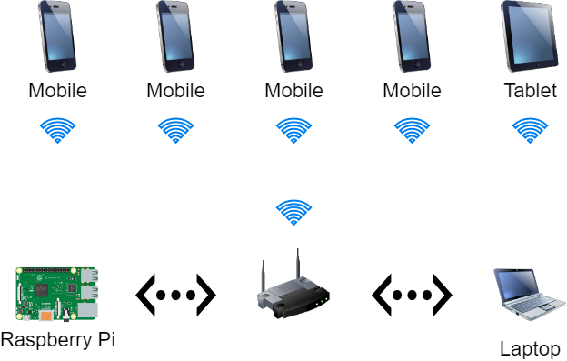

# Introduction
Let's face it: privacy doesn't (really) exist on the Internet. Everything you do is tracked by companies that specialize in collecting data.

Discover our somewhat strange computer with counters, speakers and lights that kick in when you are tracked by Google, Facebook, Amazon and others.

# Set-up
- Connect the ethernet cable to your laptop
- Open Google Chrome
- Disable all ad blockers
- Install the Webhook on Request extension, open the options, and paste the contents of [config.json](https://raw.githubusercontent.com/wie-volgt-jou-op-het-internet/browser/main/config.json).
- [Enable](http://192.168.88.100:7379/SET/enable/1) the application.   

# Technical information
- enable: [http://192.168.88.100:7379/SET/enable/1](http://192.168.88.100:7379/SET/enable/1)
- disable: [http://192.168.88.100:7379/DEL/enable](http://192.168.88.100:7379/DEL/enable)
- facebook: [http://192.168.88.100:7379/SET/facebook/1/EX/5](http://192.168.88.100:7379/SET/facebook/1/EX/5)
- amazon: [http://192.168.88.100:7379/SET/amazon/1/EX/5](http://192.168.88.100:7379/SET/amazon/1/EX/5)
- google: [http://192.168.88.100:7379/SET/google/1/EX/5](http://192.168.88.100:7379/SET/google/1/EX/5)
- microsoft: [http://192.168.88.100:7379/SET/microsoft/1/EX/5](http://192.168.88.100:7379/SET/microsoft/1/EX/5)
- x: [http://192.168.88.100:7379/SET/x/1/EX/5](http://192.168.88.100:7379/SET/x/1/EX/5)
- tiktok: [http://192.168.88.100:7379/SET/tiktok/1/EX/5](http://192.168.88.100:7379/SET/tiktok/1/EX/5)
- apple [http://192.168.88.100:7379/SET/apple/1/EX/5](http://192.168.88.100:7379/SET/apple/1/EX/5)

# Network

